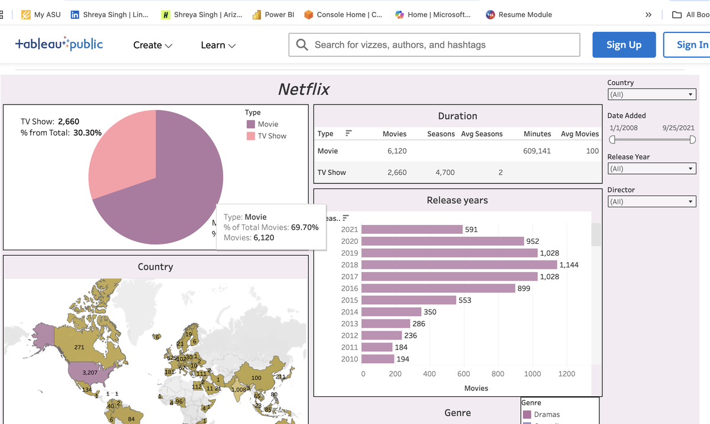
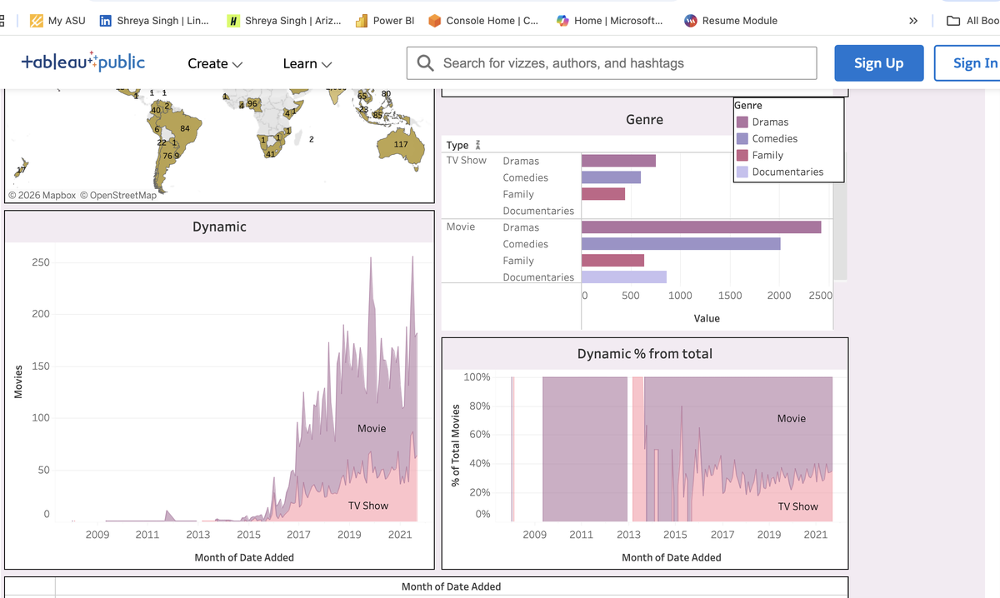

# Netflix Content Analysis | Tableau Dashboard

Ever wondered what Netflix's library actually looks like under the hood? This dashboard digs into 8,780 titles — movies and TV shows — to explore how Netflix has grown, what content it focuses on, and where it comes from.

---

## Live Dashboard

🔗 **[Click here to explore the interactive dashboard](https://public.tableau.com/app/profile/shreya.singh5357/viz/Netflix_17750390908590/Netflix?publish=yes)**
*(No login or download needed — opens straight in your browser)*

---

## Dashboard Preview

**Overview — Content Split, Country Map & Release Years**

**Genre Breakdown, Trends Over Time & Percentage Split**

---

## What This Project Is About

I used a Netflix dataset from Kaggle covering titles added between **2008 and 2021** to build an interactive dashboard in Tableau. The goal was to understand the makeup of Netflix's content — what type, which genres, which countries, and how it's changed over the years.
