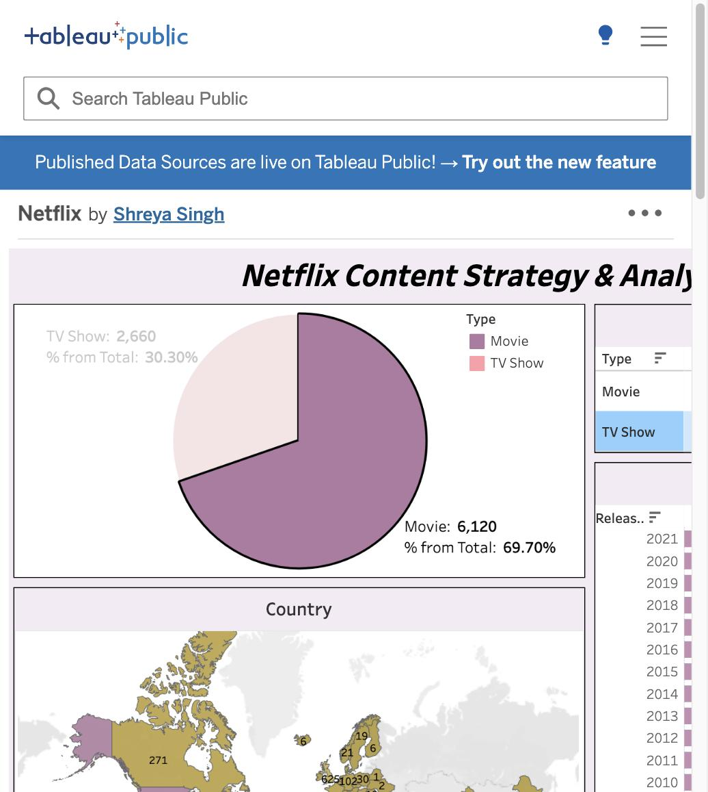

# Netflix Content Analysis | Tableau Dashboard

Ever wondered what Netflix's library actually looks like under the hood? This dashboard digs into 8,780 titles — movies and TV shows — to explore how Netflix has grown, what content it focuses on, and where it comes from.

---

## Live Dashboard

🔗 **[Click here to explore the interactive dashboard](https://public.tableau.com/app/profile/shreya.singh5357/viz/Netflix_17750390908590/Netflix?publish=yes)**
*(No login or download needed — opens straight in your browser)*

---

## Dashboard Preview

---

## What This Project Is About

I used a Netflix dataset from Kaggle covering titles added between **1925 and 2021** to build an interactive dashboard in Tableau. The goal was to understand the makeup of Netflix's content — what type, which genres, which countries, and how it's changed over the years.

---

## What I Found

- Netflix has **way more movies than shows** — 6,120 movies (69.7%) vs 2,660 TV shows (30.3%)
- The **US produces the most content** by far, with 3,207 titles. India comes second with 1,008
- **2018 was Netflix's biggest year** — 1,144 titles were added, the highest of any year
- **Dramas are the most popular genre**, both for movies and TV shows, followed by Comedies
- Movies average about **100 minutes**, and TV shows average **2 seasons**
- Content growth really took off after **2015**, which lines up with Netflix going global

---

## What's in the Dashboard

| Visual | What it tells you |
|---|---|
| Pie Chart | How movies and TV shows split across the full library |
| World Map | Which countries produce the most Netflix content |
| Release Years Chart | How many titles were released each year (1965–2021) |
| Duration Table | Average runtime for movies and number of seasons for shows |
